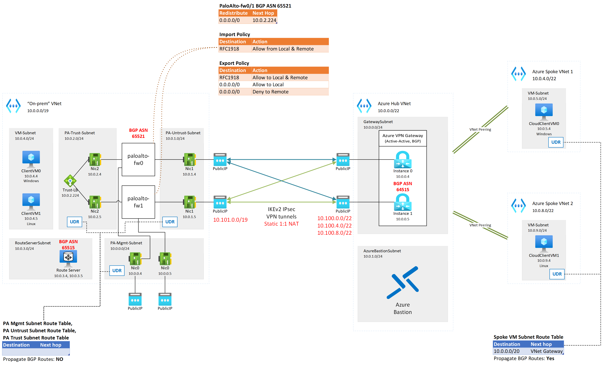
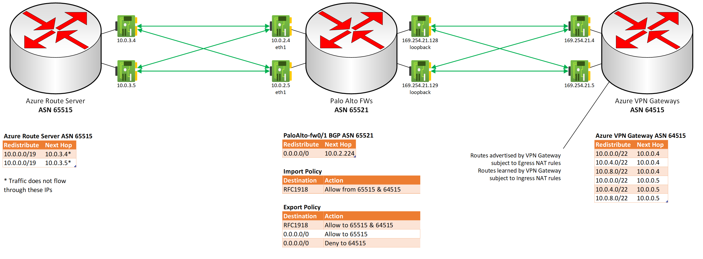
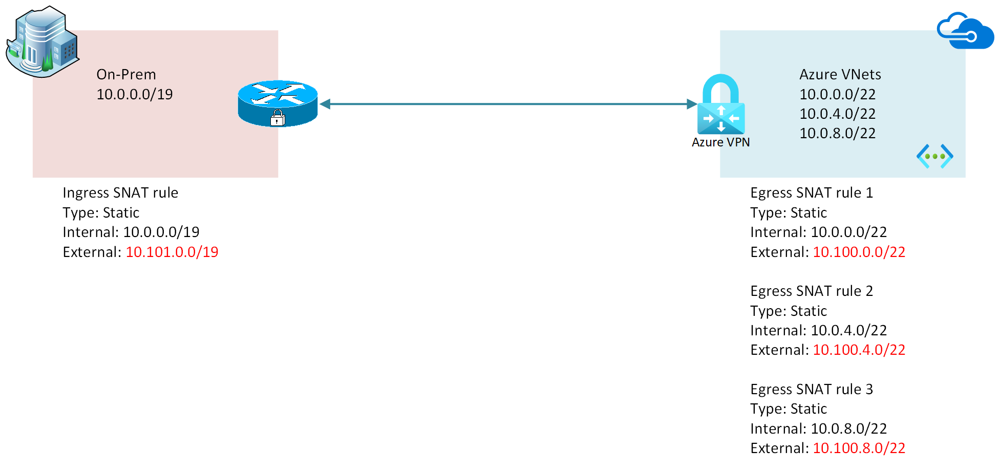

# Lab - Azure VPN Gateway Scenario: Active-Active gateways with highly available connections, using Palo Alto Firewalls, overlapping IP address space

## Intro

The goal of this lab is to demonstrate and validate traffic flow between a simulated on-premises environment, running Palo Alto Networks firewall appliances at its edge, and an Azure cloud environment using self-managed hub and spoke networking, **where the on-premises environment's IPv4 address space overlaps with the Azure cloud environment**. Dual redundancy is the target model of connectivity between the environments. See: ([Azure VPN Gateways: active-active dual redundancy](https://docs.microsoft.com/en-us/azure/vpn-gateway/vpn-gateway-highlyavailable#dual-redundancy-active-active-vpn-gateways-for-both-azure-and-on-premises-networks))

This lab builds upon concepts covered in my previous lab, [Azure VPN Active-Active gateways with highly available connections using Palo Alto firewalls](https://github.com/davmhelm/pafw-azvpngw-full-mesh-bgp).

### Lab Diagrams

The lab uses 1 VNET to simulate the on-premises environment where all Internet-bound traffic is routed through a pair Palo Alto firewalls at the edge. The cloud environment is comprised of a simple self-managed hub and spoke environment, with a shared VPN gateway at the hub. The Palo Alto firewalls are in a simulated Active-Active HA operating model, and the Azure VPN Gateway is configured as active-active for high availability as well. The on-premises environment and the cloud environment are connected to each other using site-to-site VPN and BGP. Static 1:1 NAT is applied at the Azure VPN gateway to work around the overlap of IP address spaces in on-prem and cloud environments.

Azure Bastion is used for management access to the Client VMs in the on-prem and cloud environments. To minimize costs, a single Bastion Standard SKU host is deployed in the cloud environment, and IP-based connectivity is used to connect to VMs in the on-prem environment.

Also to minimize costs, the VMs are configured with an auto-shutdown schedule based on time of day. The exact time of day and time zone are configurable.

#### Architecture



#### eBGP adjacencies 



#### NAT translation 



### Components

- Two hub VNets, one for on-prem and one for cloud, in two different regions (default Central US and West Central US respectively), where
    - The on-prem VNet has:
        - Two [PAN VM-Series Azure VMs](https://docs.paloaltonetworks.com/vm-series/10-2/vm-series-deployment/set-up-the-vm-series-firewall-on-azure) deployed in the BYOL model
            - These VMs are deployed using Palo Alto's default recommendation of 3 interfaces (Management, Untrust, and Trust)
            - UDRs are associated to the subnets of the Palo Alto VMs' network interfaces with BGP route propagation disabled (to prevent routing loops)
            - HTTPS remote management is enabled on the Management interface public IPs for your current public IP only; if you are running the deployment script in cloud shell, make sure to get the public IP of the system where you'll be logging into the PAN-OS web management interface from
            - licensing is beyond the scope of this lab, but the VMs will do what is needed to demonstrate the functionality without a license
        - A Route Server to simulate routes being exchanged inside the on-prem environment through BGP (note that Route Server speaks eBGP with its peers, so it's not a perfect representation)
            - This route server enables the Azure VNet on-premises environment to learn BGP routes from the Palo Alto Firewalls (in this example, the cloud Azure VPN Gateway is a BGP peer to the firewalls)
    - The cloud VNet has an Azure VPN Gateway deployed in Active-Active mode with BGP enabled
        - Static 1:1 NAT rules are configured for Ingress from overlapping on-premises IPv4 address space, and Egress from the overlapping Azure VNet address spaces
        - BGP NAT translation is enabled to transform the advertised networks matching NAT Egress rules sent by the VPN Gateways, and transform the networks learned from on-prem matching NAT Ingress rules
        - Because NAT cannot be applied to the next hop address for either advertisement, APIPA addresses are used to exchange routes, and those addresses are also forced to be treated as the next hops for the translated networks (see the [BGP Detail diagram](#ebgp-adjacencies) above)
- Two spoke VNets in the same region as the cloud hub VNet, where:
    - The spoke VNets are peered directly to the cloud hub VNet
    - Transit between spoke VNets is achieved using the VPN Gateway; though this is not necessarily a valid practice in a live environment, depending on the circumstances, it is sufficient to provide transitive routing in this POC
- Azure Bastion Standard SKU is deployed into the cloud hub VNet 
    - Bastion can connect to Azure VMs in cloud spoke VNets directly
- The local hub VNet has a Linux and Windows VM deployed for connectivity testing, accessible through [Bastion Standard SKU IP-based connection](https://docs.microsoft.com/en-us/azure/bastion/connect-ip-address) or [serial console](https://docs.microsoft.com/en-us/troubleshoot/azure/virtual-machines/serial-console-overview)
- The cloud spoke VNets each have a VM (one Linux, one Windows) deployed for connectivity testing, also accessible through Bastion or serial console
- The outcome of the lab will be full transit between all ends (all VMs can reach each other)
  - To reach cloud VMs from on-prem, you will need to use the external (post-NAT) IP of the VM you want to reach. For example, CloudVM0 will be reachable at 10.100.5.4 from an on-premises VM.
  - To reach on-prem VMs from cloud, you will need to use the external (post-NAT) IP of the VM you want to reach. For example, LocalVM0 will be reachable at 10.101.4.4 from a cloud VM.
- BGP: The On-prem network's ASN is assigned to 65521. Azure Route Server currently uses ASN 65515, and the [ASN cannot be changed](https://docs.microsoft.com/en-us/azure/route-server/troubleshoot-route-server#why-does-my-nva-not-receive-routes-from-azure-route-server-even-though-the-bgp-peering-is-up). In order to avoid needing to force eBGP peers to learn certain routes from the same AS they use, the Azure VPN Gateway's ASN is configured as 64515.

## Using the lab
### Deploy the lab

It is strongly recommended to download the entire lab's contents to a folder where you'll be doing the deployment. All dependencies assume you are in that folder as the current working directory. Once the environment is deployed there is a manual step required to configure the Palo Alto Firewalls using generated config XML files.

You can open [Azure Cloud Shell (bash)](https://shell.azure.com) and run the following commands to build the entire lab, though you will need to download the Palo Alto Firewall configs (*-import.xml) in order to upload them using the PAN-OS HTTPS management console.

```bash
git clone https://github.com/davmhelm/pafw-azvpngw-nat-bgp.git 
cd ./pafw-azvpngw-nat-bgp
source ./lab-deploy.azcli
```

**Note:** the provisioning process is expected to take 75-90 minutes to complete.

Alternatively (recommended), you can run step-by-step to get familiar with the provisioning process and the components deployed:
```bash
git clone https://github.com/davmhelm/pafw-azvpngw-nat-bgp.git 
cd ./pafw-azvpngw-nat-bgp

## Prerequisites
## Login
# az login
## Select subscription to deploy in
# az account list -o table
# az account set -s "subcription_name"

#####################
## Begin Variables ##
#####################

# Username and password on all VMs
vm_username=azureuser
 vm_password=+Please_Ch4ng3_M3!

# VM Auto-shutdown time and time zone
# refer to autoshutdown.bicep for valid time zone IDs
autoshutdown_time=1700
autoshutdown_tz='UTC'

# Your current public IP, needed for remote web administration of Palo Alto Firewalls
mypip=$( curl -4 'https://api.ipify.org' -s )
if [ -v ACC_CLOUD ]; then
    echo -e "*** Detected running in Cloud Shell"
    echo -e "*** ACTION REQUIRED: Please go to 'https://api.ipify.org' in a local browser window and enter the result below."
    read -p "mypip: " mypip 
fi

# Define "on-prem" network environment
localSite_rg=PanNatBgpVpnLab-local-rg
localSite_region=centralus
localSite_vnet_name=onprem-vnet
localSite_vnet_addressSpaceCidr=10.0.0.0/19
localSite_vnet_addressSpaceCidrNAT=10.101.0.0/19
localSite_vnet_PaMgmtSubnetCidr=10.0.0.0/24
localSite_vnet_PaUntrustSubnetCidr=10.0.1.0/24
localSite_vnet_PaTrustSubnetCidr=10.0.2.0/24
localSite_vnet_RouteServerSubnetCidr=10.0.3.0/24
localSite_vnet_VmSubnetCidr=10.0.4.0/24

# Define "on-prem" helper route server
localSite_vnet_routeServer_name=onprem-vnet-rs

# Define "on-prem" client VMs
localSite_vm1_name=LocalVM0
localSite_vm1_size=Standard_B2ms
localSite_vm1_staticIp=10.0.4.4

localSite_vm2_name=LocalVM1
localSite_vm2_size=Standard_B2ms
localSite_vm2_staticIp=10.0.4.5

# Define "on-prem" PA firewalls
localSite_fw_asn=65521
localSite_fw1_name=pafw0
localSite_fw1_size=Standard_B4ms # Must be a VM size that supports at least 3 NICs
localSite_fw1_staticIp_mgmt=10.0.0.4
localSite_fw1_staticIp_untrust=10.0.1.4
localSite_fw1_staticIp_trust=10.0.2.4
localSite_fw1_staticIp_tunnel1=10.0.2.64 # not expected to be routable outside of PAFW
localSite_fw1_staticIp_tunnel2=10.0.2.65 # not expected to be routable outside of PAFW
localSite_fw1_staticIp_loopback=10.0.2.128 # not expected to be routable outside of PAFW; APIPA used
localSite_fw1_staticIp_loopback_apipa=169.254.21.128 # not expected to be routable outside of PAFW; APIPA used

localSite_fw2_name=pafw1
localSite_fw2_size=Standard_B4ms # Must be a VM size that supports at least 3 NICs
localSite_fw2_staticIp_mgmt=10.0.0.5
localSite_fw2_staticIp_untrust=10.0.1.5
localSite_fw2_staticIp_trust=10.0.2.5
localSite_fw2_staticIp_tunnel1=10.0.2.66 # not expected to be routable outside of PAFW
localSite_fw2_staticIp_tunnel2=10.0.2.67 # not expected to be routable outside of PAFW
localSite_fw2_staticIp_loopback=10.0.2.129 # not expected to be routable outside of PAFW; APIPA used
localSite_fw2_staticIp_loopback_apipa=169.254.21.129 # not expected to be routable outside of PAFW; APIPA used

# Define "on-prem" firewall load balancer
localSite_lb_name=pafw-lb
localSite_lb_frontEndIp=10.0.2.224

# Define "cloud" network environment
cloudSite_rg=PanNatBgpVpnLab-cloud-rg
cloudSite_region=westcentralus
cloudSite_cidr_summary=10.0.0.0/20 # Used for spoke-to-spoke transitive routing. Must encompass all cloud VNet address spaces.
cloudSite_cidr_summaryNAT=10.100.0.0/20
cloudSite_vnet_hub_name=cloud-hub-vnet
cloudSite_vnet_hub_addressSpaceCidr=10.0.0.0/22
cloudSite_vnet_hub_addressSpaceCidrNAT=10.100.0.0/22
cloudSite_vnet_hub_gatewaySubnetCidr=10.0.0.0/24
cloudSite_vnet_hub_bastionSubnetCidr=10.0.1.0/24

cloudSite_vnet_spoke1_name=cloud-spoke1-vnet
cloudSite_vnet_spoke1_addressSpaceCidr=10.0.4.0/22
cloudSite_vnet_spoke1_addressSpaceCidrNAT=10.100.4.0/22
cloudSite_vnet_spoke1_VmSubnetCidr=10.0.5.0/24

cloudSite_vnet_spoke2_name=cloud-spoke2-vnet
cloudSite_vnet_spoke2_addressSpaceCidr=10.0.8.0/22
cloudSite_vnet_spoke2_addressSpaceCidrNAT=10.100.8.0/22
cloudSite_vnet_spoke2_VmSubnetCidr=10.0.9.0/24

# Define "cloud" VPN gateway
cloudSite_asn=64515
cloudSite_vnet_gateway_name=cloud-hub-vnet-gw
cloudSite_vnet_gateway_psk=Msft123Msft123
cloudSite_vnet_gateway_apipa_ip1=169.254.21.4
cloudSite_vnet_gateway_apipa_ip2=169.254.21.5

# Define "cloud" client VMs
cloudSite_vm1_name=CloudVM0
cloudSite_vm1_size=Standard_B2ms
cloudSite_vm1_staticIp=10.0.5.4

cloudSite_vm2_name=CloudVM1
cloudSite_vm2_size=Standard_B2ms
cloudSite_vm2_staticIp=10.0.9.4

# Define helper Bastion
cloudSite_vnet_bastion_host=cloud-bastion

# Define storage accounts for VM boot diagnostics and serial console
# recommend keeping this prefix between 1 and 12 characters 
storage_prefix=diagstorage

###################
## End Variables ##
###################

######################
## Begin Deployment ##
######################

# Generate random suffixes
lowerbound=10000
upperbound=9999999999
range=$(($upperbound-$lowerbound+1))
rand1=$(($(($(($RANDOM**2+$RANDOM))%$range))+$lowerbound))
rand2=$(($(($(($RANDOM**2+$RANDOM))%$range))+$lowerbound))
localSite_storageAccount_name=$storage_prefix$rand1
cloudSite_storageAccount_name=$storage_prefix$rand2

# 1. Create Local Environment 
# 1.1 Resource Group
echo -e "*** $(date +%T%z) Creating local site - resource group $localSite_rg in $localSite_region"
az group create --name $localSite_rg --location $localSite_region --output none

# 1.2 Deploy Networking
# Create Virtual Network
echo -e "*** $(date +%T%z) Creating local site - base networking in $localSite_region"
az network vnet create --name $localSite_vnet_name --resource-group $localSite_rg --location $localSite_region --address-prefixes $localSite_vnet_addressSpaceCidr --subnet-name PA-Mgmt-Subnet --subnet-prefix $localSite_vnet_PaMgmtSubnetCidr --output none
az network vnet subnet create --name PA-Untrust-Subnet --vnet-name $localSite_vnet_name --resource-group $localSite_rg --address-prefix $localSite_vnet_PaUntrustSubnetCidr --output none
az network vnet subnet create --name PA-Trust-Subnet --vnet-name $localSite_vnet_name --resource-group $localSite_rg --address-prefix $localSite_vnet_PaTrustSubnetCidr --output none
localSite_routeServerSubnet_id=$( az network vnet subnet create --name RouteServerSubnet --vnet-name $localSite_vnet_name --resource-group $localSite_rg --address-prefix $localSite_vnet_RouteServerSubnetCidr --query "id" --output tsv )
az network vnet subnet create --name VM-Subnet --vnet-name $localSite_vnet_name --resource-group $localSite_rg --address-prefix $localSite_vnet_VmSubnetCidr --output none

# Create Route Tables
echo -e "*** $(date +%T%z) Creating local site - route tables for networking in $localSite_region"
az network route-table create --name PA-Mgmt-Subnet-rt --resource-group $localSite_rg --location $localSite_region --disable-bgp-route-propagation true --output none
az network route-table create --name PA-Untrust-Subnet-rt --resource-group $localSite_rg --location $localSite_region --disable-bgp-route-propagation true --output none
az network route-table create --name PA-Trust-Subnet-rt --resource-group $localSite_rg --location $localSite_region --disable-bgp-route-propagation true --output none

# Create Network Security Group to restrict web admin traffic from your current public IP
echo -e "*** $(date +%T%z) Creating local site - network security groups for networking in $localSite_region"
az network nsg create --name PA-Mgmt-Subnet-nsg --resource-group $localSite_rg --location $localSite_region --output none
az network nsg rule create --name AllowHttpsWebManagementIn --resource-group $localSite_rg --nsg-name PA-Mgmt-Subnet-nsg --direction Inbound --priority 100 --protocol Tcp --source-address-prefixes $mypip/32 --source-port-ranges '*' --destination-address-prefixes '*' --destination-port-ranges '443' --description "Allow HTTPS Remote Management" --output none

# Create Network Security Group to permit IKE VPN traffic between untrust interfaces and Azure VPN Gateways
# (Rules to be added in a later step)
az network nsg create --name PA-Untrust-Subnet-nsg --resource-group $localSite_rg --location $localSite_region --output none

# Create Network Security Group to permit forwarded traffic to client VMs in either region, and for traffic to/from internet
az network nsg create --name PA-Trust-Subnet-nsg --resource-group $localSite_rg --location $localSite_region --output none
az network nsg rule create --name AllowTrafficToInternet --resource-group $localSite_rg --nsg-name PA-Trust-Subnet-nsg --direction Inbound --priority 100 --protocol '*' --source-address-prefixes VirtualNetwork --source-port-ranges '*' --destination-address-prefixes Internet --destination-port-ranges '*' --description "Permit forwarding of Internet-bound traffic" --output none
az network nsg rule create --name AllowTrafficToRemoteSites --resource-group $localSite_rg --nsg-name PA-Trust-Subnet-nsg --direction Inbound --priority 200 --protocol '*' --source-address-prefixes VirtualNetwork --source-port-ranges '*' --destination-address-prefixes $cloudSite_cidr_summaryNAT --destination-port-ranges '*' --description "Permit forwarding of traffic coming from remote site" --output none
az network nsg rule create --name AllowTrafficFromInternet --resource-group $localSite_rg --nsg-name PA-Trust-Subnet-nsg --direction Outbound --priority 100 --protocol '*' --source-address-prefixes Internet --source-port-ranges '*' --destination-address-prefixes VirtualNetwork --destination-port-ranges '*' --description "Permit forwarding of reply traffic from Internet" --output none
az network nsg rule create --name AllowTrafficFromRemoteSites --resource-group $localSite_rg --nsg-name PA-Trust-Subnet-nsg --direction Outbound --priority 200 --protocol '*' --source-address-prefixes $cloudSite_cidr_summaryNAT --source-port-ranges '*' --destination-address-prefixes VirtualNetwork --destination-port-ranges '*' --description "Permit forwarding of traffic bound for remote site" --output none

# Update Subnets
az network vnet subnet update --name Pa-Mgmt-Subnet --vnet-name $localSite_vnet_name --resource-group $localSite_rg --route-table PA-Mgmt-Subnet-rt --network-security-group PA-Mgmt-Subnet-nsg --output none
az network vnet subnet update --name Pa-Untrust-Subnet --vnet-name $localSite_vnet_name --resource-group $localSite_rg --route-table PA-Untrust-Subnet-rt --network-security-group PA-Mgmt-Subnet-nsg --output none
az network vnet subnet update --name Pa-Trust-Subnet --vnet-name $localSite_vnet_name --resource-group $localSite_rg --route-table PA-Trust-Subnet-rt --network-security-group PA-Trust-Subnet-nsg --output none

# Create Load Balancer for NVA VMs
echo -e "*** $(date +%T%z) Creating local site - Internal load balancer for Palo Alto Firewalls in $localSite_region"
az network lb create --name $localSite_lb_name --resource-group $localSite_rg --sku Standard --private-ip-address $localSite_lb_frontEndIp --vnet-name $localSite_vnet_name --vnet-name $localSite_vnet_name --subnet Pa-Trust-Subnet --output none
az network lb address-pool create --name backendpool --resource-group $localSite_rg --lb-name $localSite_lb_name --output none
az network lb probe create --name myHealthProbe --resource-group $localSite_rg --lb-name $localSite_lb_name --protocol tcp --port 22 --output none
az network lb rule create --name myHaPortsRule --resource-group $localSite_rg --lb-name $localSite_lb_name --protocol All --frontend-port 0 --backend-port 0 --backend-pool-name backendpool --probe-name myHealthProbe --output none

# Create storage account for VM Diagnostics serial console
echo -e "*** $(date +%T%z) Creating local site - boot diagnostics storage account in $localSite_region"
localSite_storageUri=$( az storage account create --name $localSite_storageAccount_name --resource-group $localSite_rg --location $localSite_region --kind StorageV2 --sku Standard_LRS --query "primaryEndpoints.blob" --output tsv )

# 1.3 Deploy Palo Alto Firewalls
echo -e "*** $(date +%T%z) Creating local site - Palo Alto Firewalls in $localSite_region"
az vm image terms accept --urn paloaltonetworks:vmseries-flex:byol:latest --output none

# Create public IPs
localSite_fw1_publicIp_mgmt=$( az network public-ip create --name $localSite_fw1_name-mgmt-pip --resource-group $localSite_rg --location $localSite_region --idle-timeout 4 --sku Standard --query "publicIp.ipAddress" --output tsv )
localSite_fw1_publicIp_untrust=$( az network public-ip create --name $localSite_fw1_name-untrust-pip --resource-group $localSite_rg --location $localSite_region --idle-timeout 4 --sku Standard --query "publicIp.ipAddress" --output tsv )
localSite_fw2_publicIp_mgmt=$( az network public-ip create --name $localSite_fw2_name-mgmt-pip --resource-group $localSite_rg --location $localSite_region --idle-timeout 4 --sku Standard --query "publicIp.ipAddress" --output tsv )
localSite_fw2_publicIp_untrust=$( az network public-ip create --name $localSite_fw2_name-untrust-pip --resource-group $localSite_rg --location $localSite_region --idle-timeout 4 --sku Standard --query "publicIp.ipAddress" --output tsv )

# Create network interfaces
az network nic create --name $localSite_fw1_name-eth0-mgmt-nic --resource-group $localSite_rg --vnet-name $localSite_vnet_name --subnet PA-Mgmt-Subnet --private-ip-address $localSite_fw1_staticIp_mgmt --public-ip-address $localSite_fw1_name-mgmt-pip --output none
az network nic create --name $localSite_fw1_name-eth1-untrust-nic --resource-group $localSite_rg --vnet-name $localSite_vnet_name --subnet PA-Untrust-Subnet --private-ip-address $localSite_fw1_staticIp_untrust --public-ip-address $localSite_fw1_name-untrust-pip --ip-forwarding true --output none
az network nic create --name $localSite_fw1_name-eth2-trust-nic --resource-group $localSite_rg --vnet-name $localSite_vnet_name --subnet PA-Trust-Subnet --private-ip-address $localSite_fw1_staticIp_trust --ip-forwarding true --lb-name $localSite_lb_name --lb-address-pools backendpool --output none
az network nic create --name $localSite_fw2_name-eth0-mgmt-nic --resource-group $localSite_rg --vnet-name $localSite_vnet_name --subnet PA-Mgmt-Subnet --private-ip-address $localSite_fw2_staticIp_mgmt --public-ip-address $localSite_fw2_name-mgmt-pip --output none
az network nic create --name $localSite_fw2_name-eth1-untrust-nic --resource-group $localSite_rg --vnet-name $localSite_vnet_name --subnet PA-Untrust-Subnet --private-ip-address $localSite_fw2_staticIp_untrust --public-ip-address $localSite_fw2_name-untrust-pip --ip-forwarding true --output none
az network nic create --name $localSite_fw2_name-eth2-trust-nic --resource-group $localSite_rg --vnet-name $localSite_vnet_name --subnet PA-Trust-Subnet --private-ip-address $localSite_fw2_staticIp_trust --ip-forwarding true --lb-name $localSite_lb_name --lb-address-pools backendpool --output none

# Create NVA VMs
az vm create --name $localSite_fw1_name --resource-group $localSite_rg --size $localSite_fw1_size --nics $localSite_fw1_name-eth0-mgmt-nic $localSite_fw1_name-eth1-untrust-nic $localSite_fw1_name-eth2-trust-nic --image paloaltonetworks:vmseries-flex:byol:latest --admin-username $vm_username --admin-password $vm_password --boot-diagnostics-storage $localSite_storageUri --no-wait --output none
az vm create --name $localSite_fw2_name --resource-group $localSite_rg --size $localSite_fw2_size --nics $localSite_fw2_name-eth0-mgmt-nic $localSite_fw2_name-eth1-untrust-nic $localSite_fw2_name-eth2-trust-nic --image paloaltonetworks:vmseries-flex:byol:latest --admin-username $vm_username --admin-password $vm_password --boot-diagnostics-storage $localSite_storageUri --no-wait --output none

# 1.4 Deploy client VMs
echo -e "*** $(date +%T%z) Creating local site - client VMs in $localSite_region"
# Create network interfaces
az network nic create --name $localSite_vm1_name-nic --resource-group $localSite_rg --vnet-name $localSite_vnet_name --subnet VM-Subnet --private-ip-address $localSite_vm1_staticIp --output none
az network nic create --name $localSite_vm2_name-nic --resource-group $localSite_rg --vnet-name $localSite_vnet_name --subnet VM-Subnet --private-ip-address $localSite_vm2_staticIp --output none

# Create VMs
# az vm image terms accept --urn Canonical:0001-com-ubuntu-server-jammy:22_04-lts-gen2:latest --output none # not needed, no terms to accept
az vm create --name $localSite_vm1_name --resource-group $localSite_rg --size $localSite_vm1_size --nics $localSite_vm1_name-nic --image Canonical:0001-com-ubuntu-server-jammy:22_04-lts-gen2:latest --admin-username $vm_username --admin-password $vm_password --boot-diagnostics-storage $localSite_storageUri --no-wait --output none
az vm create --name $localSite_vm2_name --resource-group $localSite_rg --size $localSite_vm2_size --nics $localSite_vm2_name-nic --image MicrosoftWindowsServer:WindowsServer:2022-datacenter-azure-edition-smalldisk:latest --admin-username $vm_username --admin-password $vm_password --boot-diagnostics-storage $localSite_storageUri --no-wait --output none

# Install Extensions on VMs
# Wait for Linux VM to be ready
az vm wait --name $localSite_vm1_name --resource-group $localSite_rg --exists --output none

# Install network tools on Linux VM
az vm extension set --name CustomScript --resource-group $localSite_rg --vm-name $localSite_vm1_name --publisher Microsoft.Azure.Extensions --protected-settings "{\"fileUris\": [\"https://raw.githubusercontent.com/davmhelm/azure-vm-net-tools/main/script/nettools.sh\"],\"commandToExecute\": \"./nettools.sh\"}" --no-wait --output none

# Install Network Watcher Agent on Linux VM for later connectivity testing
az vm extension set --name NetworkWatcherAgentLinux --resource-group $localSite_rg --vm-name $localSite_vm1_name --publisher Microsoft.Azure.NetworkWatcher --no-wait --output none

# Wait for Windows VM to be ready
az vm wait --name $localSite_vm2_name --resource-group $localSite_rg --exists --output none

# Install network tools on Windows VM
az vm extension set --name CustomScriptExtension --resource-group $localSite_rg --vm-name $localSite_vm2_name --publisher Microsoft.Compute --protected-settings "{\"fileUris\": [\"https://raw.githubusercontent.com/davmhelm/azure-vm-net-tools/main/script/nettools.ps1\"],\"commandToExecute\": \"powershell.exe -file ./nettools.ps1\"}" --no-wait --output none

# Install Network Watcher Agent on Windows VM for later connectivity testing
az vm extension set --name NetworkWatcherAgentWindows --resource-group $localSite_rg --vm-name $localSite_vm2_name --publisher Microsoft.Azure.NetworkWatcher --no-wait --output none

# 1.5 Deploy Route Server
echo -e "*** $(date +%T%z) Creating local site - route server in $localSite_region *** CAN TAKE UP TO 20 MINUTES ***"
# Create public IP
az network public-ip create --name $localSite_vnet_routeServer_name-pip --resource-group $localSite_rg --location $localSite_region --idle-timeout 4 --sku Standard --output none

# Deploy Route Server instance
read localSite_asn localSite_routeServer_ip1 localSite_routeServer_ip2 <<< $( az network routeserver create --name $localSite_vnet_routeServer_name --resource-group $localSite_rg --location $localSite_region --public-ip $localSite_vnet_routeServer_name-pip --hosted-subnet $localSite_routeServerSubnet_id --query "{asn:virtualRouterAsn,ips:sort(virtualRouterIps)} | {asn:asn,ip1:ips[0],ip2:ips[1]}" --output tsv )

# Configure Route Server peerings
# Don't use --no-wait, tends to lead to provisioning failures
az network routeserver peering create --name $localSite_fw1_name-peer --resource-group $localSite_rg --routeserver $localSite_vnet_routeServer_name --peer-asn $localSite_fw_asn --peer-ip $localSite_fw1_staticIp_trust --output none
az network routeserver peering create --name $localSite_fw2_name-peer --resource-group $localSite_rg --routeserver $localSite_vnet_routeServer_name --peer-asn $localSite_fw_asn --peer-ip $localSite_fw2_staticIp_trust --output none

# 2. Create Cloud Environment

# 2.1 Resource Group
echo -e "*** $(date +%T%z) Creating cloud site - resource group $cloudSite_rg in $cloudSite_region"
az group create --name $cloudSite_rg --location $cloudSite_region --output none

# 2.2 Deploy Networking
# Create Virtual Networks
echo -e "*** $(date +%T%z) Creating cloud site - base networking in $cloudSite_region"
az network vnet create --name $cloudSite_vnet_hub_name --resource-group $cloudSite_rg --location $cloudSite_region --address-prefixes $cloudSite_vnet_hub_addressSpaceCidr --subnet-name GatewaySubnet --subnet-prefix $cloudSite_vnet_hub_gatewaySubnetCidr --output none
az network vnet subnet create --name AzureBastionSubnet --vnet-name $cloudSite_vnet_hub_name --resource-group $cloudSite_rg --address-prefix $cloudSite_vnet_hub_bastionSubnetCidr --output none
az network vnet create --name $cloudSite_vnet_spoke1_name --resource-group $cloudSite_rg --location $cloudSite_region --address-prefixes $cloudSite_vnet_spoke1_addressSpaceCidr --subnet-name VM-Subnet --subnet-prefix $cloudSite_vnet_spoke1_VmSubnetCidr --output none
az network vnet create --name $cloudSite_vnet_spoke2_name --resource-group $cloudSite_rg --location $cloudSite_region --address-prefixes $cloudSite_vnet_spoke2_addressSpaceCidr --subnet-name VM-Subnet --subnet-prefix $cloudSite_vnet_spoke2_VmSubnetCidr --output none

# Create Route Table
echo -e "*** $(date +%T%z) Creating cloud site - route tables for networking in $cloudSite_region"
az network route-table create --name VM-Subnet-rt --resource-group $cloudSite_rg --location $cloudSite_region --output none
az network route-table route create --name Transitive-via-Gateway --route-table-name VM-Subnet-rt --resource-group $cloudSite_rg --address-prefix $cloudSite_cidr_summary --next-hop-type VirtualNetworkGateway --output none

# Update Subnets
az network vnet subnet update --name VM-Subnet --vnet-name $cloudSite_vnet_spoke1_name --resource-group $cloudSite_rg --route-table VM-Subnet-rt --output none
az network vnet subnet update --name VM-Subnet --vnet-name $cloudSite_vnet_spoke2_name --resource-group $cloudSite_rg --route-table VM-Subnet-rt --output none

# 2.3 Deploy VPN Gateway
echo -e "*** $(date +%T%z) Creating cloud site - VPN gateway in $cloudSite_region -- *** CAN TAKE UP TO 45 MINUTES ***"
# Create public IPs 
az network public-ip create --name $cloudSite_vnet_gateway_name-pip1 --resource-group $cloudSite_rg --location $cloudSite_region --idle-timeout 4 --sku Standard --output none
az network public-ip create --name $cloudSite_vnet_gateway_name-pip2 --resource-group $cloudSite_rg --location $cloudSite_region --idle-timeout 4 --sku Standard --output none

# Create Gateway instances
cloudSite_vpngw_bgpPeeringAddressesJson=$( az network vnet-gateway create --name $cloudSite_vnet_gateway_name --resource-group $cloudSite_rg --location $cloudSite_region --vnet $cloudSite_vnet_hub_name --gateway-type VPN --vpn-gateway-generation Generation2 --sku VpnGw2  --public-ip-addresses $cloudSite_vnet_gateway_name-pip1 $cloudSite_vnet_gateway_name-pip2 --asn $cloudSite_asn --query "vnetGateway.bgpSettings | bgpPeeringAddresses" --output json )
# --no-wait is not helpful here, remainder of networking steps depend on gateway being in ProvisioningState: Succeeded

# Need jq for advanced json array manipulation
cloudSite_vpngw_bgpPeeringAddressesJson_update=$(echo -e "$cloudSite_vpngw_bgpPeeringAddressesJson" | jq -c "[.[] | select( .ipconfigurationId | endswith(\"0\") ).customBgpIpAddresses |= . + [\"$cloudSite_vnet_gateway_apipa_ip1\"] | select( .ipconfigurationId | endswith(\"1\") ).customBgpIpAddresses |= . + [\"$cloudSite_vnet_gateway_apipa_ip2\"]]")
cloudSite_vpngw_publicIp1=$( echo -e "$cloudSite_vpngw_bgpPeeringAddressesJson_update" | jq -r ".[] | select( .ipconfigurationId | endswith(\"0\") ).tunnelIpAddresses[0]" ) 
cloudSite_vpngw_publicIp2=$( echo -e "$cloudSite_vpngw_bgpPeeringAddressesJson_update" | jq -r ".[] | select( .ipconfigurationId | endswith(\"1\") ).tunnelIpAddresses[0]" )
cloudSite_vpngw_connection_gatewayCustomBgpIpAddressesJson=$( echo -e "$cloudSite_vpngw_bgpPeeringAddressesJson_update" | jq -c "[.[] | {ipConfigurationId: .ipconfigurationId, customBgpIpAddress: .customBgpIpAddresses[0]}]" )
# Update Gateway to use NAT rules for BGP routes, and add APIPA custom addresses to the gateway instances
# For active-active, both instances must be updated in the same API call, and we don't want these updates to block any following updates, so wait for completion
az network vnet-gateway update --name $cloudSite_vnet_gateway_name --resource-group $cloudSite_rg --set enableBgpRouteTranslationForNat=true --set bgpSettings.bgpPeeringAddresses=$cloudSite_vpngw_bgpPeeringAddressesJson_update --output none

# Create VPN NAT Rules
echo -e "*** $(date +%T%z) Creating cloud site - NAT Rules for VPN connections to local site Palo Alto Firewalls in $cloudSite_region"
az network vnet-gateway nat-rule add --name Ingress_OnPrem --resource-group $cloudSite_rg --gateway-name $cloudSite_vnet_gateway_name --mode IngressSnat --type Static --internal-mappings $localSite_vnet_addressSpaceCidr --external-mappings $localSite_vnet_addressSpaceCidrNAT --output none
az network vnet-gateway nat-rule add --name Egress_$cloudSite_vnet_hub_name --resource-group $cloudSite_rg --gateway-name $cloudSite_vnet_gateway_name --mode EgressSnat --type Static --internal-mappings $cloudSite_vnet_hub_addressSpaceCidr --external-mappings $cloudSite_vnet_hub_addressSpaceCidrNAT --output none
az network vnet-gateway nat-rule add --name Egress_$cloudSite_vnet_spoke1_name --resource-group $cloudSite_rg --gateway-name $cloudSite_vnet_gateway_name --mode EgressSnat --type Static --internal-mappings $cloudSite_vnet_spoke1_addressSpaceCidr --external-mappings $cloudSite_vnet_spoke1_addressSpaceCidrNAT --output none
az network vnet-gateway nat-rule add --name Egress_$cloudSite_vnet_spoke2_name --resource-group $cloudSite_rg --gateway-name $cloudSite_vnet_gateway_name --mode EgressSnat --type Static --internal-mappings $cloudSite_vnet_spoke2_addressSpaceCidr --external-mappings $cloudSite_vnet_spoke2_addressSpaceCidrNAT --output none

# Create Peerings (must happen after gateway is created)
echo -e "*** $(date +%T%z) Creating cloud site - vnet peerings in $cloudSite_region"
az network vnet peering create --name hub-to-spoke1 --resource-group $cloudSite_rg --vnet-name $cloudSite_vnet_hub_name --remote-vnet $cloudSite_vnet_spoke1_name --allow-forwarded-traffic --allow-vnet-access --allow-gateway-transit --output none
az network vnet peering create --name spoke1-to-hub --resource-group $cloudSite_rg --vnet-name $cloudSite_vnet_spoke1_name --remote-vnet $cloudSite_vnet_hub_name --allow-forwarded-traffic --allow-vnet-access --use-remote-gateways --output none
az network vnet peering create --name hub-to-spoke2 --resource-group $cloudSite_rg --vnet-name $cloudSite_vnet_hub_name --remote-vnet $cloudSite_vnet_spoke2_name --allow-forwarded-traffic --allow-vnet-access --allow-gateway-transit --output none
az network vnet peering create --name spoke2-to-hub --resource-group $cloudSite_rg --vnet-name $cloudSite_vnet_spoke2_name --remote-vnet $cloudSite_vnet_hub_name --allow-forwarded-traffic --allow-vnet-access --use-remote-gateways --output none

# Create Local Gateways for Palo Alto firewalls
az network local-gateway create --name $localSite_fw1_name --resource-group $cloudSite_rg --location $cloudSite_region --gateway-ip-address $localSite_fw1_publicIp_untrust --asn $localSite_fw_asn --bgp-peering-address $localSite_fw1_staticIp_loopback_apipa --output none
az network local-gateway create --name $localSite_fw2_name --resource-group $cloudSite_rg --location $cloudSite_region --gateway-ip-address $localSite_fw2_publicIp_untrust --asn $localSite_fw_asn --bgp-peering-address $localSite_fw2_staticIp_loopback_apipa --output none

# Create VPN Connections & apply NAT Rules
echo -e "*** $(date +%T%z) Creating cloud site - VPN connections to local site Palo Alto Firewalls in $cloudSite_region"
# Current preview version of --ingress-nat-rule and --egress-nat-rule require natRule resource IDs as parameters
ingress_natRule_ids=$( az network vnet-gateway nat-rule list --gateway-name $cloudSite_vnet_gateway_name --resource-group $cloudSite_rg --query "[?mode=='IngressSnat'].id" --output tsv )
egress_natRule_ids=$( az network vnet-gateway nat-rule list --gateway-name $cloudSite_vnet_gateway_name --resource-group $cloudSite_rg --query "[?mode=='EgressSnat'].id" --output tsv )
az network vpn-connection create --name $localSite_fw1_name-connection --resource-group $cloudSite_rg --vnet-gateway1 $cloudSite_vnet_gateway_name --local-gateway2 $localSite_fw1_name --enable-bgp --shared-key $cloudSite_vnet_gateway_psk --ingress-nat-rule $ingress_natRule_ids --egress-nat-rule $egress_natRule_ids --output none
az network vpn-connection create --name $localSite_fw2_name-connection --resource-group $cloudSite_rg --vnet-gateway1 $cloudSite_vnet_gateway_name --local-gateway2 $localSite_fw2_name --enable-bgp --shared-key $cloudSite_vnet_gateway_psk --ingress-nat-rule $ingress_natRule_ids --egress-nat-rule $egress_natRule_ids --output none

# Configure VPN connections to use custom BGP IP addresses
az network vpn-connection update --name $localSite_fw1_name-connection --resource-group $cloudSite_rg --set gatewayCustomBgpIpAddresses=$cloudSite_vpngw_connection_gatewayCustomBgpIpAddressesJson --output none
az network vpn-connection update --name $localSite_fw2_name-connection --resource-group $cloudSite_rg --set gatewayCustomBgpIpAddresses=$cloudSite_vpngw_connection_gatewayCustomBgpIpAddressesJson --output none

# Configure phase1/phase2 policy on VPN connections
az network vpn-connection ipsec-policy add --connection-name $localSite_fw1_name-connection --resource-group $cloudSite_rg --ike-encryption AES128 --ike-integrity SHA256 --dh-group DHGroup2 --ipsec-encryption AES128 --ipsec-integrity SHA256 --pfs-group None --sa-lifetime 102400 --sa-max-size 27000 --output none
az network vpn-connection ipsec-policy add --connection-name $localSite_fw2_name-connection --resource-group $cloudSite_rg --ike-encryption AES128 --ike-integrity SHA256 --dh-group DHGroup2 --ipsec-encryption AES128 --ipsec-integrity SHA256 --pfs-group None --sa-lifetime 102400 --sa-max-size 27000 --output none

# Add NSG rule to permit connection attempts from Azure VPN Gateways to Palo Alto Firewalls
echo -e "*** $(date +%T%z) Updating local site - network security group for Palo Alto Firewall Untrust interfaces in $localSite_region"
az network nsg rule create --name AllowTrafficFromAzureVpnGateways --resource-group $localSite_rg --nsg-name PA-Untrust-Subnet-nsg --direction Inbound --priority 100 --protocol Udp --source-address-prefixes $cloudSite_vpngw_publicIp1/32 $cloudSite_vpngw_publicIp2/32 --source-port-ranges '*' --destination-address-prefixes '*' --destination-port-ranges 500 4500 --description "Permit incoming IKE traffic" --output none

# Create storage account for VM Diagnostics serial console
echo -e "*** $(date +%T%z) Creating cloud site - boot diagnostics storage account in $cloudSite_region"
cloudSite_storageUri=$( az storage account create --name $cloudSite_storageAccount_name --resource-group $cloudSite_rg --location $cloudSite_region --kind StorageV2 --sku Standard_LRS --query "primaryEndpoints.blob" --output tsv )

# 2.4 Deploy client VMs
echo -e "*** $(date +%T%z) Creating cloud site - client VMs in $cloudSite_region"
# Create network interfaces
az network nic create --name $cloudSite_vm1_name-nic --resource-group $cloudSite_rg --vnet-name $cloudSite_vnet_spoke1_name --subnet VM-Subnet --private-ip-address $cloudSite_vm1_staticIp --output none
az network nic create --name $cloudSite_vm2_name-nic --resource-group $cloudSite_rg --vnet-name $cloudSite_vnet_spoke2_name --subnet VM-Subnet --private-ip-address $cloudSite_vm2_staticIp --output none

# Create VMs
az vm create --name $cloudSite_vm1_name --resource-group $cloudSite_rg --size $cloudSite_vm1_size --nics $cloudSite_vm1_name-nic --image Canonical:0001-com-ubuntu-server-jammy:22_04-lts-gen2:latest --admin-username $vm_username --admin-password $vm_password --boot-diagnostics-storage $cloudSite_storageUri --no-wait --output none
az vm create --name $cloudSite_vm2_name --resource-group $cloudSite_rg --size $cloudSite_vm2_size --nics $cloudSite_vm2_name-nic --image MicrosoftWindowsServer:WindowsServer:2022-datacenter-azure-edition-smalldisk:latest --admin-username $vm_username --admin-password $vm_password --boot-diagnostics-storage $cloudSite_storageUri --no-wait --output none

# Install extensions on VMs
# Wait for Linux VM to be ready
az vm wait --name $cloudSite_vm1_name --resource-group $cloudSite_rg --exists --output none

# Install network tools on Linux VM
az vm extension set --name CustomScript --resource-group $cloudSite_rg --vm-name $cloudSite_vm1_name --publisher Microsoft.Azure.Extensions --protected-settings "{\"fileUris\": [\"https://raw.githubusercontent.com/davmhelm/azure-vm-net-tools/main/script/nettools.sh\"],\"commandToExecute\": \"./nettools.sh\"}" --no-wait --output none

# Install Network Watcher Agent on Linux VM for later connectivity testing
az vm extension set --name NetworkWatcherAgentLinux --resource-group $cloudSite_rg --vm-name $cloudSite_vm1_name --publisher Microsoft.Azure.NetworkWatcher --no-wait --output none

# Wait for Windows VM to be ready
az vm wait --name $cloudSite_vm2_name --resource-group $cloudSite_rg --exists --output none

# Install network tools on Windows VM
az vm extension set --name CustomScriptExtension --resource-group $cloudSite_rg --vm-name $cloudSite_vm2_name --publisher Microsoft.Compute --protected-settings "{\"fileUris\": [\"https://raw.githubusercontent.com/davmhelm/azure-vm-net-tools/main/script/nettools.ps1\"],\"commandToExecute\": \"powershell.exe -file ./nettools.ps1\"}" --no-wait --output none

# Install Network Watcher Agent on Windows VM for later connectivity testing
az vm extension set --name NetworkWatcherAgentWindows --resource-group $cloudSite_rg --vm-name $cloudSite_vm2_name --publisher Microsoft.Azure.NetworkWatcher --no-wait --output none

# 3. Configure Helper Resources
echo -e "*** $(date +%T%z) Creating helper resources - bastion in $cloudSite_region *** CAN TAKE UP TO 10 MINUTES"
# Azure Bastion
az network public-ip create --name $cloudSite_vnet_bastion_host-pip --resource-group $cloudSite_rg --location $cloudSite_region --idle-timeout 4 --sku Standard --output none
bastion_id=$( az network bastion create --name $cloudSite_vnet_bastion_host --resource-group $cloudSite_rg --location $cloudSite_region --vnet-name $cloudSite_vnet_hub_name --public-ip-address $cloudSite_vnet_bastion_host-pip --sku Standard --query "id" --output tsv )

# Configure Bastion to allow IP-based connections so you can use Bastion to connect to NATed IPs in on-premises environment
az resource update --ids $bastion_id --set properties.enableIpConnect=true properties.enableTunneling=true --output none

# Enable VM auto-shutdown to save on costs
echo -e "*** $(date +%T%z) Creating helper resources - enabling auto-shutdown schedules for VMs in $localSite_rg and $cloudSite_rg"
localVmIds=$( az vm list --resource-group $localSite_rg --query '[*].id' --output tsv )
cloudVmIds=$( az vm list --resource-group $cloudSite_rg --query '[*].id' --output tsv )
for vm_id in ${localVmIds[@]}; do
    vmName=${vm_id##*/}
    az deployment group create --name deploy-vm-schedule-$vmName --resource-group $localSite_rg --template-file ./autoshutdown.bicep --parameters vmName=$vmName location=$localSite_region targetVmId=$vm_id shutdownTime=$autoshutdown_time timeZone="$autoshutdown_tz" --no-wait --output none
done

for vm_id in ${cloudVmIds[@]}; do
    vmName=${vm_id##*/}
    az deployment group create --name deploy-vm-schedule-$vmName --resource-group $cloudSite_rg --template-file ./autoshutdown.bicep --parameters vmName=$vmName location=$cloudSite_region targetVmId=$vm_id shutdownTime=$autoshutdown_time timeZone="$autoshutdown_tz" --no-wait --output none
done

# 4. Configure Palo Alto Firewalls

## mapping of Palo Alto Config Template Variables to script variables
# _my_hostname_ == $localSite_fw(1,2)_name
# _eth1_privateIp_ == $localSite_fw(1,2)_staticIp_untrust
# _eth1_publicIp_ == $localSite_fw(1,2)_publicIp_untrust
# _eth2_privateIp_ == $localSite_fw(1,2)_staticIp_trust
# _tunnel1_privateIp_ == $localSite_fw(1,2)_staticIp_tunnel1
# _tunnel2_privateIp_ == $localSite_fw(1,2)_staticIp_tunnel2
# _loopback_privateIp_ == $localSite_fw(1,2)_staticIp_loopback
# _loopback_apipaIp_ == $localSite_fw(1,2)_staticIp_loopback_apipa
# _pafw_asn_ == $localSite_fw_asn
# _azVpnGw_publicIp1_ == $cloudSite_vpngw_publicIp1
## _azVpnGw_privateIp1_ == $cloudSite_vpngw_privateIp1
# _azVpnGw_publicIp2_ == $cloudSite_vpngw_publicIp2
## _azVpnGw_privateIp2_ == $cloudSite_vpngw_privateIp2
# _azVpnGw_apipaIp1_ == $cloudSite_vnet_gateway_apipa_ip1
# _azVpnGw_apipaIp2_ == $cloudSite_vnet_gateway_apipa_ip1
# _azVpnGw_asn_ == $cloudSite_asn
# _routeServer_privateIp1_ == $localSite_routeServer_ip1
# _routeServer_privateIp2_ == $localSite_routeServer_ip2
# _routeServer_asn_ == $localSite_asn
# _azlb_frontEndIp_ == $localSite_lb_frontEndIp

# Create first Palo Alto config
echo -e "*** $(date +%T%z) Preparing local site - Palo Alto firewall configurations"
sed -e "s/_my_hostname_/$localSite_fw1_name/g" \
    -e "s/_eth1_privateIp_/$localSite_fw1_staticIp_untrust/g" \
    -e "s/_eth1_publicIp_/$localSite_fw1_publicIp_untrust/g" \
    -e "s/_eth2_privateIp_/$localSite_fw1_staticIp_trust/g" \
    -e "s/_tunnel1_privateIp_/$localSite_fw1_staticIp_tunnel1/g" \
    -e "s/_tunnel2_privateIp_/$localSite_fw1_staticIp_tunnel2/g" \
    -e "s/_loopback_privateIp_/$localSite_fw1_staticIp_loopback/g" \
    -e "s/_loopback_apipaIp_/$localSite_fw1_staticIp_loopback_apipa/g" \
    -e "s/_pafw_asn_/$localSite_fw_asn/g" \
    -e "s/_azVpnGw_publicIp1_/$cloudSite_vpngw_publicIp1/g" \
    -e "s/_azVpnGw_apipaIp1_/$cloudSite_vnet_gateway_apipa_ip1/g" \
    -e "s/_azVpnGw_publicIp2_/$cloudSite_vpngw_publicIp2/g" \
    -e "s/_azVpnGw_apipaIp2_/$cloudSite_vnet_gateway_apipa_ip2/g" \
    -e "s/_azVpnGw_asn_/$cloudSite_asn/g" \
    -e "s/_routeServer_privateIp1_/$localSite_routeServer_ip1/g" \
    -e "s/_routeServer_privateIp2_/$localSite_routeServer_ip2/g" \
    -e "s/_routeServer_asn_/$localSite_asn/g" \
    -e "s/_azlb_frontEndIp_/$localSite_lb_frontEndIp/g" \
    ./pafw-config-template.xml > ./$localSite_fw1_name-import.xml

# Create second Palo Alto firewall config
sed -e "s/_my_hostname_/$localSite_fw2_name/g" \
    -e "s/_eth1_privateIp_/$localSite_fw2_staticIp_untrust/g" \
    -e "s/_eth1_publicIp_/$localSite_fw2_publicIp_untrust/g" \
    -e "s/_eth2_privateIp_/$localSite_fw2_staticIp_trust/g" \
    -e "s/_tunnel1_privateIp_/$localSite_fw2_staticIp_tunnel1/g" \
    -e "s/_tunnel2_privateIp_/$localSite_fw2_staticIp_tunnel2/g" \
    -e "s/_loopback_privateIp_/$localSite_fw2_staticIp_loopback/g" \
    -e "s/_loopback_apipaIp_/$localSite_fw2_staticIp_loopback_apipa/g" \
    -e "s/_pafw_asn_/$localSite_fw_asn/g" \
    -e "s/_azVpnGw_publicIp1_/$cloudSite_vpngw_publicIp1/g" \
    -e "s/_azVpnGw_apipaIp1_/$cloudSite_vnet_gateway_apipa_ip1/g" \
    -e "s/_azVpnGw_publicIp2_/$cloudSite_vpngw_publicIp2/g" \
    -e "s/_azVpnGw_apipaIp2_/$cloudSite_vnet_gateway_apipa_ip2/g" \
    -e "s/_azVpnGw_asn_/$cloudSite_asn/g" \
    -e "s/_routeServer_privateIp1_/$localSite_routeServer_ip1/g" \
    -e "s/_routeServer_privateIp2_/$localSite_routeServer_ip2/g" \
    -e "s/_routeServer_asn_/$localSite_asn/g" \
    -e "s/_azlb_frontEndIp_/$localSite_lb_frontEndIp/g" \
    ./pafw-config-template.xml > ./$localSite_fw2_name-import.xml

# Install Configs
echo -e "\
*** $(date +%T%z) ACTION REQUIRED: Install pafw XML config files on firewalls
For each firewall:
1. Browse to the HTTPS management page for each firewall
   $localSite_fw1_name: https://$localSite_fw1_publicIp_mgmt
   $localSite_fw2_name: https://$localSite_fw2_publicIp_mgmt
2. Sign in to the firewall
3. Select Device tab
4. Select Operations tab
5. Select Import Named Configuration Snapshot, and upload the named XML file in this folder corresponding to the firewall:
   $localSite_fw1_name-import.xml
   $localSite_fw2_name-import.xml
6. Select Load Named Configuration Snapshot, and select the XML file you previously uploaded
7. Select Commit (top right corner of the management portal) and commit the configuration

NOTE! The configs are created assuming the following defaults:
   vm_username: azureuser
   vm_password: +Please_Ch4ng3_M3!
   cloudSite_vnet_gateway_psk: Msft123Msft123"
echo -e "*** $(date +%T%z) Automated deployment complete."

####################
## End Deployment ##
####################

# See lab-examine.azcli for tests to validate environment
```

### Applying firewall configs
Below is a video that demonstrates the steps of:
1. signing into the HTTPS managment page of a Palo Alto firewall,
2. Importing, loading, and committing the generated config.xml file, and
3. Checking the status of VPN tunnels and BGP routes after the configuration is applied

https://user-images.githubusercontent.com/21045679/183094641-4545549a-3245-4a76-ad88-fd79929bd53d.mp4

## Test Connectivity

The [lab-examine](./lab-examine.azcli) script contains commands to check the effective routes on the deployed VMs, along with BGP routes advertised by/learned by the Route Server and VPN Gateway. There are also commands to test ICMP connectivity between VMs using Azure Network Watcher. 

Additionally, you can connect to the lab VMs using Azure Bastion to run your network tools of choice to validate connectivity (hping, traceroute, etc).

```bash
# Parameters
localSite_rg=PanNatBgpVpnLab-local-rg
cloudSite_rg=PanNatBgpVpnLab-cloud-rg

# These are reminders of the post-NAT translated address spaces for local site and cloud site
# They aren't used directly in the script, but you'll want to keep them in mind once we get to 
# the Network Watcher section of the examination script
#localSite_cidr_summaryNAT=10.101.0.0/19
#cloudSite_cidr_summaryNAT=10.100.0.0/20


######################################
## Tests to examine the environment ##
######################################

# 1) Test connectivity between VMs

# get lists of NICs
localNics=$( az network nic list --resource-group $localSite_rg --query '[].name' --output tsv)
cloudNics=$( az network nic list --resource-group $cloudSite_rg --query '[].name' --output tsv)

# Get list of VM private IPs
for nicname in ${localNics[@]}; do
    privateIp=$( az network nic show --name $nicname --resource-group $localSite_rg --query 'ipConfigurations[].privateIpAddress' --output tsv )
    echo -e "$localSite_rg/$nicname private IP: $privateIp"
done
echo -e ""

for nicname in ${cloudNics[@]}; do
    privateIp=$( az network nic show --name $nicname --resource-group $cloudSite_rg --query 'ipConfigurations[].privateIpAddress' --output tsv )
    echo -e "$cloudSite_rg/$nicname private IP: $privateIp"
done

echo -e ""

# Dump VM route tables
for nicname in ${localNics[@]}; do
    echo -e "$localSite_rg/$nicname effective routes:"
    az network nic show-effective-route-table --name $nicname --resource-group $localSite_rg --output table
    echo -e ""
done

for nicname in ${cloudNics[@]}; do
    echo -e "$cloudSite_rg/$nicname effective routes:"
    az network nic show-effective-route-table --name $nicname --resource-group $cloudSite_rg --output table
    echo -e ""
done

# 2) Check BGP

# Dump Route Server Advertised routes
# https://docs.microsoft.com/en-us/cli/azure/network/routeserver?view=azure-cli-latest
rsname=$( az network routeserver list --resource-group $localSite_rg --query '[0].name' --output tsv)
rspeerings=$( az network routeserver peering list --routeserver $rsname --resource-group $localSite_rg --query '[].name' --output tsv)

echo -e "*** $localSite_rg/$rsname Route Server peerings: ***"
az network routeserver peering list --routeserver $rsname --resource-group $localSite_rg --query '[].{name:name,peerIp:peerIp,asn:Asn}' --output table
echo -e ""

for peer in ${rspeerings[@]}; do
    echo -e "*** $localSite_rg/$rsname/$peer advertised routes: **"
    az network routeserver peering list-advertised-routes --name $peer --resource-group $localSite_rg --routeserver $rsname --query "[RouteServiceRole_IN_0,RouteServiceRole_IN_1][]" --output table
    echo -e ""

    echo -e "*** $localSite_rg/$rsname/$peer learned routes: **"
    az network routeserver peering list-learned-routes --name $peer --resource-group $localSite_rg --routeserver $rsname --query "[RouteServiceRole_IN_0,RouteServiceRole_IN_1][]" --output table
    echo -e ""
done

# Dump VPN Gateway learned routes
vpngw=$( az network vnet-gateway list --resource-group $cloudSite_rg --query '[0].name' --output tsv )

echo -e "*** $cloudSite_rg/$vpngw BGP peer status ***"
az network vnet-gateway list-bgp-peer-status --name $vpngw --resource-group $cloudSite_rg --output table
echo -e ""
echo -e "*** $cloudSite_rg/$vpngw BGP learned routes ***"
az network vnet-gateway list-learned-routes --name $vpngw --resource-group $cloudSite_rg --output table
echo -e ""

# VPN Gateways advertised routes per BGP peer.
ips=$( az network vnet-gateway list-bgp-peer-status --name $vpngw --resource-group $cloudSite_rg --query 'value[].{ip:neighbor}' --output tsv )
for ip in ${ips[@]}; do
    echo -e "*** $cloudSite_rg/$vpngw advertised routes to peer $ip ***"
    az network vnet-gateway list-advertised-routes --name $vpngw --resource-group $cloudSite_rg --peer $ip --output table
    echo -e ""
done

# Azure Network Watcher 
# https://docs.microsoft.com/en-us/azure/network-watcher/network-watcher-connectivity-cli
# https://docs.microsoft.com/en-us/azure/network-watcher/network-watcher-connectivity-portal

localVmIds=$( az vm list --resource-group $localSite_rg --query "[?plan.publisher!='paloaltonetworks'].id" --output tsv )
cloudVmIds=$( az vm list --resource-group $cloudSite_rg --query "[?plan.publisher!='paloaltonetworks'].id" --output tsv )

# Network Watcher needs some help when NAT is in the picture. We have to translate the IPs before testing.

# Local VM->Cloud VM appears to work now
for vmid_source in ${localVmIds[@]}; do 
    for vmid_dest in ${cloudVmIds[@]}; do
        if [ "$vmid_source" != "$vmid_dest" ]; then
            echo -e "*** Testing connectivity from ${vmid_source##*/} to ${vmid_dest##*/} ***"
            
            # Apply naive NAT to private IP of destination VM
            destIp=$( az vm show --ids $vmid_dest --show-details --query "privateIps" --output tsv )
            destIpNAT=$(echo $destIp | sed 's/10.0./10.100./g' )
            
            az network watcher test-connectivity --source-resource $vmid_source --dest-address $destIpNAT --protocol icmp --output table
            echo -e ""
        fi
    done
done

# Cloud VM->Local VM should work
for vmid_source in ${cloudVmIds[@]}; do 
    for vmid_dest in ${localVmIds[@]}; do
        if [ "$vmid_source" != "$vmid_dest" ]; then
            echo -e "*** Testing connectivity from ${vmid_source##*/} to ${vmid_dest##*/} ***"
            
            # Apply naive NAT to private IP of destination VM
            destIp=$( az vm show --ids $vmid_dest --show-details --query "privateIps" --output tsv )
            destIpNAT=$(echo $destIp | sed 's/10.0./10.101./g' )
            
            az network watcher test-connectivity --source-resource $vmid_source --dest-address $destIpNAT --protocol icmp --output table
            echo -e ""
        fi
    done
done

# Local VM->Local VM should work
for vmid_source in ${localVmIds[@]}; do 
    for vmid_dest in ${localVmIds[@]}; do
        if [ "$vmid_source" != "$vmid_dest" ]; then
            echo -e "*** Testing connectivity from ${vmid_source##*/} to ${vmid_dest##*/} ***"

            # Local to local -- NO NAT NEEDED HERE

            az network watcher test-connectivity --source-resource $vmid_source --dest-resource $vmid_dest --protocol icmp --output table
            echo -e ""
        fi
    done
done

# Cloud VM->Cloud VM should work
for vmid_source in ${cloudVmIds[@]}; do 
    for vmid_dest in ${cloudVmIds[@]}; do
        if [ "$vmid_source" != "$vmid_dest" ]; then
            echo -e "*** Testing connectivity from ${vmid_source##*/} to ${vmid_dest##*/} ***"

            # Cloud to cloud -- NO NAT NEEDED HERE

            az network watcher test-connectivity --source-resource $vmid_source --dest-resource $vmid_dest --protocol icmp --output table
            echo -e ""
        fi
    done
done

# Test connectivity of local VMs to a web address
for vmid_source in ${localVmIds[@]}; do 
    echo -e "*** Testing connectivity from ${vmid_source##*/} to web address https://www.bing.com ***"
    az network watcher test-connectivity --source-resource $vmid_source --dest-address 'https://www.bing.com' --protocol tcp --dest-port 443 --output table
    echo -e ""
done

# Test connectivity of cloud VMs to a web address
for vmid_source in ${cloudVmIds[@]}; do 
    echo -e "*** Testing connectivity from ${vmid_source##*/} to web address https://www.bing.com ***"
    az network watcher test-connectivity --source-resource $vmid_source --dest-address 'https://www.bing.com' --protocol tcp --dest-port 443 --output table
    echo -e ""
done
```

## Clean Up

Simply delete the resource groups created by lab-deploy.azcli script. You will be prompted for confirmation of each group's deletion.

```bash
az group delete --name $localSite_rg --force-deletion-types Microsoft.Compute/virtualMachines --no-wait
az group delete --name $cloudSite_rg --force-deletion-types Microsoft.Compute/virtualMachines --no-wait
```

## Thanks
Thanks are owed to the many labs I've studied to help put this together. Not an exhaustive list, but these include:
* [dmauser/azure-vm-net-tools](https://github.com/dmauser/azure-vm-net-tools)
* [dmauser/azure-vpn-s2s-nat](https://github.com/dmauser/azure-vpn-s2s-nat)
* [jwrightazure/lab/pan-vpn-to-azurevpngw-ikev2-bgp](https://github.com/jwrightazure/lab/tree/main/pan-vpn-to-azurevpngw-ikev2-bgp)
* [jwrightazure/lab/PAN-BGP-ARS](https://github.com/jwrightazure/lab/tree/main/PAN-BGP-ARS)
* [jwrightazure/lab/VWAN-InternetAccess-Spoke-PaloAlto](https://github.com/jwrightazure/lab/tree/main/VWAN-InternetAccess-Spoke-PaloAlto)

## FAQ

### Why are there 3 Egress Static 1:1 NAT Rules? Can I summarize thoes as 1 rule with a shorter prefix length?
In practice, I've found that Egress Static NAT rules on the Azure VPN gateway, with BGP route translation enabled, will make the Azure VPN gateway advertise that summarized route to its connected peers. In an earlier version of the lab, I had one Egress Rule for "VNET" with the internal mapping 10.0.0.0/20, and external mapping 10.100.0.0/20. However, this does not align with [official guidance in Microsoft documentation](https://docs.microsoft.com/en-us/azure/vpn-gateway/nat-overview#what-do-i-do-if-my-vnet-or-local-network-gateway-address-space-has-two-or-more-prefixes-can-i-apply-nat-to-all-of-them-or-just-a-subset). At of the time this lab was written, I **cannot advise** relying on such behavior.

### Why is a standard Bastion host SKU used instead of a basic SKU like in the [previous lab](https://github.com/davmhelm/pafw-azvpngw-full-mesh-bgp)?
In the previous lab, all VNets had their own distinct non-overlapping address spaces, which made a single Bastion network directly peered to all VNets a viable option. Because there is not a similar option that NATs private VNet-to-VNet peered traffic (at the time this lab was written), if you try the same approach in this lab you'll fail to peer with the first VNet that overlaps an existing peered VNet's address space. Bastion standard SKU is very slightly lower in cost per hour than the cost of two Bastion basic SKU hosts, so I elected to use that. Plus, it provided me with an opportunity to try out the IP-based connection feature.
